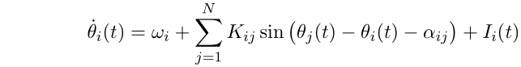

# kuramoto
An efficient C implementation of the standard Kuramoto coupled oscillators system

with Matlab interface.

To compile the C code, in a terminal navigate to the kuramoto/C directory and type 'make' (assuming the 'make' program is installed on your system).

To build the Matlab interface, in Matlab navigate to the kuramoto/Matlab directory and run 'makemex' at the Matlab prompt. Alternatively, you can also run 'make' at a terminal in the kuramoto/Matlab directory; you will need the 'mex' and 'makemex' executables on your system executable path (these can be found in the 'bin' directory of your Matlab installation).

Building has been tested on gcc (Linux 64-bit), mingw-w64 (Windows 64-bit) and Clang/LLVM (macOS). Note that MSVC (still) does not fully support the C99 standard, so may have problems building.

To test the Matlab interface, we recommend that you run the kuramto_demo.m script in the Matlab directory.

If someone would like to contribute a Python (NumPy) interface, please contact the maintainer.

Lionel Barnett: lionelb@sussex.ac.uk
